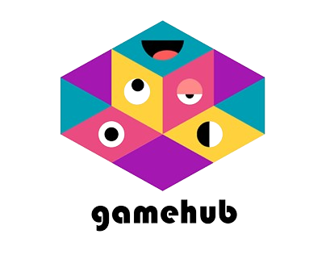

# GameHub

<div align="center">
  
  <h3>An All-in-One Gaming Platform</h3>
  <p>Experience multiple games in a single, seamless application</p>
</div>

## 🎮 Overview

GameHub is a feature-rich, modern gaming platform that brings together multiple game experiences in one place. It combines classic games like Wordle and Tic-Tac-Toe with an immersive 3D Sims-like simulation, all wrapped in a sleek, user-friendly interface.

The platform is designed to showcase how different gaming technologies can be integrated into a cohesive experience, featuring both single-player and multiplayer capabilities.

## ✨ Features

- **Multiple Game Selection**: Play various games in one application
- **Sleek UI/UX**: Modern, responsive interface with intuitive navigation
- **3D Simulation**: Explore and interact in a 3D environment
- **Real-time Multiplayer**: Connect with other players in the Sims Clone
- **Customizable Characters**: Personalized avatars with customizable appearance
- **Multi-language Support**: Internationalization for global accessibility

## 🎯 Games

### Wordle
- Word-guessing game with unlimited plays
- Visual feedback for correct/incorrect letters
- Sleek keyboard interface
- Game statistics and reset functionality

### Tic-Tac-Toe
- Classic two-player game with modern styling
- Real-time win detection
- Game reset functionality
- Clean, intuitive interface

### Sims Clone
- Immersive 3D environment built with Three.js
- Real-time multiplayer interactions using Socket.io
- Character customization (hair, clothing, etc.)
- Dynamic movement and pathfinding
- Interactive environment with various objects and furniture

## 🛠️ Technologies

### Frontend
- **React.js**: Core UI library
- **Three.js**: 3D rendering and environment
- **Socket.io Client**: Real-time communication
- **React Router**: Navigation and routing
- **Jotai**: State management
- **i18next**: Internationalization

### Backend
- **Node.js**: Server runtime
- **Socket.io**: Real-time bidirectional communication
- **Pathfinding.js**: Character movement algorithms

### Tools & Utilities
- **Vite**: Build tool and development server
- **React Icons**: UI icons
- **Lottie Web**: Animation rendering

## 🏗️ Architecture

The project follows a client-server architecture:

- **Client**: React application handling UI, game logic, and 3D rendering
- **Server**: Node.js backend managing real-time communication, character states, and game environment

## 📂 Project Structure

```
game-hub/
├── client/                  # React frontend
│   ├── public/              # Public assets
│   ├── src/                 # Source files
│   └── package.json          # Frontend dependencies
├── server/                  # Node.js backend
│   ├── src/                 # Source files
│   └── package.json          # Backend dependencies
├── .gitignore                # Ignored files and directories
├── README.md                # Project documentation
└── LICENSE                   # License information
```

## 🚀 Getting Started

To get a local copy up and running, follow these simple steps.

### Prerequisites

- Node.js (v14.0 or later)
- npm or yarn

### Installation

1. Clone the repository

   ```bash
   git clone https://github.com/yourusername/game-hub.git
   ```

2. Install dependencies

   ```bash
   cd game-hub
   npm install
   ```

3. Start the development server

   ```bash
   npm start
   ```

4. Open your browser and navigate to `http://localhost:3000`

## 🤝 Contributing

Contributions are welcome! Please feel free to submit a Pull Request.

## 📄 License

This project is licensed under the MIT License - see the LICENSE file for details.